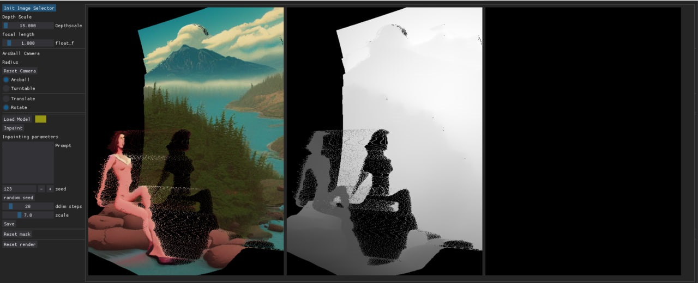

# GUI application for create animation with stable diffusion model

This script create pointcloud from image and apply different transformation to create series of images with camera movement.

## Showcase

WIP interface preview:




This program uses Stable Diffusion Inpainting model for filling gaps caused by rotation camera. Depthmap is estimated by MiDaS model or LeReS.

For pointcloud rendering using pure pytorch render.

## Installation

1. Install dependencies

    ```bash
    pip install -r requirements.txt
    ```

2. Download weights

    TODO: add stable diffusion weights link
    TODO: add depth model weights link
    TODO: add FILM weights

3. Install repositories

    - LeRes
    - MiDaS
    - FILM-pytorch

## Using

1. Prepare init image
2. Choose depthscale
3. Rotate camera
4. Select inpainting mask
5. Set inpainting options
6. Save Keyframe
7. Repeat points 2-6
8. Create animation with frame interpolation and optional upscaling

## Dependencies

1. PyTorch
2. Stable Diffusion
3. MiDaS, LeReS
4. DearPyGUI
5. OpenCV
6. Automatic1111 API

## Examples

1. 3D camera movement


2. Img2Img with zoom example
videos/test2.mp4
